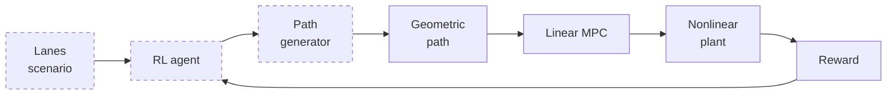

# Tractor-Trailer RL Path Planning: Code Audit, Python Port, and an Improved Design

2026-09-21 · @Someone

## Summary

**The shipped MATLAB file fails on its own documented example.** Run `ttv_rl_episode` with the path in its header comment and the default config, and it terminates at 23% of the path with reward -1.00, because the tractor's front tyre slip reaches 0.232 rad against a 0.200 rad failure limit. That is not a bug in the code: the example path demands 0.77 g of lateral acceleration at the default 20 m/s, and a saturating tyre needs 0.21 rad of slip to produce that force. The example only survives at 12 m/s or below.

I ported the file to Python line-for-line and verified the port is exact: the hand-assembled linear MPC matrix `Ac` matches the automatic-differentiation Jacobian of the nonlinear plant to 1.7e-14 relative. So every finding below is about the code, not the translation.

**Ten findings from the audit** (Part 7). The four that change results most:

| # | Finding | Measurement |
| --- | --- | --- |
| 1 | The documented example is infeasible as configured | fails at 23% progress, 0.232 rad front slip |
| 2 | The slip reward reference is extrapolated past its own failure limit | Eq. (3) returns 0.543 rad at 72 km/h; the limit is 0.200 rad |
| 3 | The smoothness term is invisible next to the slip term | ratio 300 : 1 |
| 4 | The smoothness term depends on how densely you sampled the path | 5.6x spread for the same geometry |

**The physics changes completely for a truck.** On dry or damp asphalt a laden 40 t rig rolls over at 0.37 g but only slides at 0.90 g. The binding constraint moves from tyre friction to rollover, which is why the shipped 0.2 rad slip test can never fire on a truck: the rig is already on its side.

**The controller matters as much as the path.** On a lane change at the rollover curvature ceiling, the shipped MPC weights (`Qphi = Qq = 0`, articulation logged but never damped) give a peak Load Transfer Ratio of 1.20, which is a rollover. Adding articulation damping to the same MPC on the same path gives 0.69.

**What I built.** A Python package in three layers: a faithful port with its verification suite; a 40 t highway tractor-semitrailer environment where every parameter is derived from a legal or physical constraint and audited; and an RL planner with the safety limit built into the action space rather than punished after the fact. Across 1000 random actions the action space produced **no rollover at all**, and its one collision was on a scenario that no steering-only planner could have solved.

**Against a two-MPC planner** — a nonlinear kinematic planning MPC plus the same tracking MPC, which is the method you are using now — on 60 held-out scenarios: the RL planner wins by +0.044 mean reward with a **78% win rate** (paired t = +4.57), reaching **95.6% of the attainable optimum** against the planner's 87.6%. The win is in the tail rather than the mean: worst case 0.131 vs -0.051, peak Load Transfer Ratio 0.193 vs 0.245, trailer off-tracking 0.147 m vs 0.181 m, and 1.5 ms of planning time against 15.3 ms.

**But on the hard tail the two are tied**, and by one reading the planner is ahead — it had no collisions where the RL planner had one in sixty. And out of distribution both collapse, because 97% of those scenarios cannot be solved by steering at all: the correct answer is the brake, and neither the paper's formulation nor mine has one. Part 12 sets out exactly what the evidence supports and what it does not, and the honest headline is that **the biggest missing capability is longitudinal control, not a better planner**.

## Part 1 — What the file is, and what it is not

`ttv_rl_episode.m` implements the lower two-thirds of the paper's Fig. 2 and none of the top. It is the *evaluator*, not the agent.



The solid boxes are in the file. The dashed ones are not: there is no agent, no state space, no path generator. The file's own docstring says so — *"The RL action is assumed to have already been converted into a geometric path."* You supply an N×2 array of x-y points and it hands back a scalar reward. Those three missing boxes are most of what Part 10 adds.

### The call chain

One call to `ttv_rl_episode(pathInput, cfg)` runs this sequence.

| Order | Function | What it does |
| --- | --- | --- |
| 1 | `ttv_default_config` | Fills 40-odd defaults, derives static axle loads, validates |
| 2 | `ensure_casadi` | Checks CasADi is importable |
| 3 | `prepare_path` | Dedupes points, rotates into a path-fixed frame, computes s, psi, kappa, kappa', kappa'' |
| 4 | `build_environment` | Discretises the linear model, builds the IPOPT NLP, builds the plant. Cached. |
| 5 | `build_linear_prediction_model` | The 7-state linear lateral model used for prediction |
| 6 | `build_nonlinear_plant` | The 8-state nonlinear plant used as ground truth |
| 7 | the step loop | preview → solve MPC → integrate plant → log → check failures |
| 8 | reward block | Paper Eqs. (3)–(6) |
| 9 | `make_metrics` | Summary statistics for the log |

### The two models, and why there are two

This is the single most important thing to understand about the file, and it is easy to miss because both models describe the same vehicle.

|  | Prediction model | Plant |
| --- | --- | --- |
| Built by | `build_linear_prediction_model` | `build_nonlinear_plant` |
| States | 7: y, y\_dot, psi, r1, phi, q, delta\_act | 8: X1, Y1, psi1, v1, r1, phi, q, delta\_act |
| Tyres | linear, Fy = C·alpha | saturating, Fy = mu·Fz·tanh(C·alpha/(mu·Fz)) |
| Steering | first-order lag, unsaturated | first-order lag with a tanh rate limit |
| Used for | the MPC's internal forecast | integrating the truth, and scoring |
| Frame | road-fixed, small angles | global, exact |

The MPC plans against the optimistic linear model and the reward is computed from the pessimistic nonlinear one. The gap between them is deliberate — it is the sim-to-real stand-in — but it grows fast. Measured open-loop, at a 1° steering step the linear model predicts lateral displacement 0.9% high; at 3° it is 8% high; at 8° it is 59% high and the *articulation angle comes out with the wrong sign*. So the MPC gets progressively more optimistic exactly where the path gets hard, which is where an RL agent is being asked to operate.

### `cfg` in one table

| Field | Default | Unit | Meaning |
| --- | --- | --- | --- |
| `T` | 0.1 | s | control period and MPC discretisation step |
| `N` | 10 | – | prediction horizon, so 1.0 s of preview |
| `V` | 20 | m/s | constant longitudinal speed; there is no throttle |
| `maxEpisodeTime` | 30 | s | episode cap |
| `plantSubsteps` | 5 | – | RK4 substeps per control period |
| `deltaMax` | 0.5 | rad | steering limit, on both the command and delta\_act |
| `deltaRateMax` | 0.6 | rad/s | plant-side steering rate limit (tanh, not a clip) |
| `steeringTimeConstant` | 0.15 | s | actuator lag |
| `phiMax`, `qMax` | inf | rad, rad/s | articulation limits — off by default |
| `m1`, `m2` | 5760, 6640 | kg | tractor, trailer mass; 12.4 t total |
| `a1`, `b1` | 1.10, 2.39 | m | tractor CoG to front, rear axle |
| `a2`, `b2` | 5.21, 3.28 | m | hitch to trailer CoG, trailer CoG to trailer axle |
| `c` | 1.64 | m | tractor CoG to hitch, measured rearward |
| `Iz1`, `Iz2` | 34823, 179992 | kg·m² | yaw inertias |
| `C1`–`C3` | 223281 | N/rad | per-axle cornering stiffness, all three equal |
| `mu` | 0.90 | – | friction coefficient |
| `Fz1`–`Fz3` | derived | N | static axle loads, from a moment balance about the hitch |

`Fz1`–`Fz3` are worth a look because they show the model's internal consistency: the hitch load is `m2·g·b2/(a2+b2)`, the trailer axle carries the rest of the trailer, and the tractor's front axle takes `(b1·m1·g + (b1-c)·hitchLoad)/(a1+b1)`. That is a correct moment balance, and it means changing a mass or a length automatically re-derives the loads that scale the tyre saturation.

## Part 2 — The nonlinear plant

This is the ground truth: a 5-degree-of-freedom yaw-plane model of a tractor and a semitrailer joined at a hitch, with saturating tyres. Speed is constant, so there is no longitudinal degree of freedom and no brake or throttle anywhere in the file.

### State vector

`xp = [X1; Y1; psi1; v1; r1; phi; q; delta_act]`

| Index | Symbol | Unit | Meaning |
| --- | --- | --- | --- |
| 1–2 | X1, Y1 | m | tractor CoG position in the road frame |
| 3 | psi1 | rad | tractor heading |
| 4 | v1 | m/s | tractor lateral velocity, *not* sideslip angle |
| 5 | r1 | rad/s | tractor yaw rate |
| 6 | phi | rad | articulation angle |
| 7 | q | rad/s | articulation rate |
| 8 | delta\_act | rad | actual road-wheel steering angle |

The sign convention is not stated in the file, but it is recoverable from the code. The trailer's velocity transform reads `V2 = V·cos(phi) + (v1 - c·r1)·sin(phi)`, which is the hitch velocity rotated by +phi, and the model sets `r2 = r1 + q` with `phi_dot = q`. Both are only consistent with **phi = psi2 - psi1**, so the trailer heading is `psi1 + phi`. I needed this to place the trailer's axles for the off-tracking metric in Part 10, and getting it backwards silently mirrors the trailer.

### Slip angles

```latex
\alpha_1 = \delta - \arctan\!\frac{v_1 + a_1 r_1}{V}, \qquad
\alpha_2 = -\arctan\!\frac{v_1 - b_1 r_1}{V}, \qquad
\alpha_3 = -\arctan\!\frac{v_2 - b_2 r_2}{V_2}
```

The trailer's slip angle uses the trailer's own forward speed `V2`, not `V`. That matters at large articulation and it is done correctly here.

### Tyre model

```latex
F_{y,i} = \mu F_{z,i} \tanh\!\left(\frac{C_i \alpha_i}{\mu F_{z,i}}\right)
```

This is the mechanism behind the failure in Part 6. At small slip the tanh is linear and `Fy = C·alpha` exactly, so it agrees with the prediction model. As `C·alpha` approaches `mu·Fz` the force saturates and the slip angle needed for a given force runs away. With the shipped numbers the tractor's front axle carries 44.1 kN, so `mu·Fz1` = 39.7 kN. To produce 33 kN of cornering force — what 0.77 g demands — you need `tanh(z) = 0.83`, so `z = 1.19`, so `alpha = 1.19 × 39.7/223.3 = 0.212 rad`. The measured failure was 0.232 rad. The linear model would have predicted 0.148 rad, comfortably inside the 0.2 rad limit. That 43% underestimate is the whole story.

### The 5x5 descriptor solve

The articulated dynamics are not written as explicit accelerations. Instead the code assembles a 5x5 system and solves it at every RK4 stage:

```latex
M(\varphi)\,\zeta = b(x), \qquad
\zeta = [\dot v_1,\ \dot r_1,\ \dot q,\ F_{hx},\ F_{hy}]^{T}
```

The last two unknowns are the hitch constraint forces. This is the right way to handle a closed kinematic constraint: rather than eliminating the hitch algebraically, you solve for the reaction forces alongside the accelerations. Rows 1–2 are the tractor's lateral and yaw equations, rows 3–5 are the trailer's, and the trigonometric terms in `M` are what couple them.

The shipped diagnostics block exists to check this solve, and it is worth running once. On the docstring example:

| Diagnostic | Result |
| --- | --- |
| relative residual of M·zeta - b | max 1.6e-15 |
| reciprocal condition number of M | 3.7e-6 to 3.8e-6 |
| phi\_dot - q identity | exactly 0 |

So the solve is healthy. The `rcond` of \~4e-6 looks alarming but is not: `M` mixes masses (\~10^3), inertias (\~10^5) and dimensionless constraint rows, so its condition number is dominated by units, not by near-singularity.

### Integration

`rk4_step` is textbook RK4 with the correct `(k1 + 2k2 + 2k3 + k4)/6` weights, called `plantSubsteps = 5` times per control period, so the effective integration step is 20 ms against a 100 ms control period. That is a sensible ratio for a system whose fastest mode is the 0.15 s steering lag.

## Part 3 — The linear prediction model, and the trick that makes it look wrong

If you read `build_linear_prediction_model` expecting the usual bicycle-model algebra, it looks like it has bugs. Row 2 of `Ac` multiplies some entries of `Av` by `V`; row 4 divides others by `V`. Neither is dimensionally obvious. Here is what is actually going on.

### The descriptor system

The function first builds a 4x4 descriptor system in the vehicle's own frame:

```latex
M \dot z + K z = G \delta, \qquad z = [r_1,\ \beta,\ q,\ \varphi]^{T}
```

The second state is **beta, the tractor's sideslip ANGLE**, not its lateral velocity. Nothing in the file says so. You can prove it from the matrix entries: every element of `M`'s second column carries a factor `V` (`m1·c·V`, `(m1+m2)·V`, `m1·a2·V`), which is exactly what appears when you write the lateral equation as `m·V·beta_dot` instead of `m·v1_dot`. Correspondingly `K`'s second column holds bare cornering stiffnesses, because `C_i·beta` is already a force.

The fourth row is the giveaway: `M`'s row 4 is `[0,0,0,1]` and `K`'s is `[0,0,-1,0]`, so the fourth equation says `z_dot(4) = z(3)`. Since `phi_dot = q`, that fixes `z(3) = q` and `z(4) = phi`.

### Where the factors of V come from

With `beta = v1/V` and the small-angle relation `beta ≈ y_dot/V - psi`, the y-acceleration row follows directly:

```latex
\ddot y = V(\dot\psi + \dot\beta) = V r_1 + V\!\left[A_{21} r_1 + A_{22}\!\left(\tfrac{\dot y}{V} - \psi\right) + A_{23} q + A_{24}\varphi + B_2\delta\right]
```

Collecting terms gives coefficients `A22` on y\_dot, `-V·A22` on psi, `V(A21+1)` on r1, `V·A23` on q, `V·A24` on phi and `V·B2` on delta — which is line for line what the code writes. The yaw-rate row instead substitutes `beta` directly, so it picks up `A12/V` on y\_dot and `-A12` on psi. **Both are correct.** The asymmetry is not a bug; it is the difference between an equation for `V·beta_dot` and one for `beta`.

### I verified this rather than trusting the derivation

The check that settles it: take the automatic-differentiation Jacobian of the *nonlinear plant* at the origin, drop the X1 row and column, and change coordinates into the MPC's state with the exact linear map implied by `y_dot = V·sin(psi) + v1·cos(psi)`.

| Quantity | Result |
| --- | --- |
| max absolute difference, Ac vs plant Jacobian | 2.8e-14 |
| max relative difference | 1.7e-14 |
| max difference in Bc | 0.0 |

So the hand-assembled `Ac` **is** the linearisation of the nonlinear plant, to machine precision. That is a strong result: it validates the derivation, the sideslip convention, and my port all at once.

### The MPC state and its open-loop modes

`x = [y; y_dot; psi; r1; phi; q; delta_act]`, input `u = delta_ref`.

Eigenvalues of `Ac` at the shipped 20 m/s: `-6.67` (the steering lag, `-1/0.15`), a damped pair at `-2.46`, another at `-0.75`, and **two at exactly zero**. Those two zeros are `y` and `psi` being absolute road-frame coordinates rather than errors — a double integrator through `psi_dot = r1` and `y_dot`.

This has a practical consequence I hit in Part 10. Because the model is written in a road-fixed frame, it cannot represent steady-state cornering: `psi` grows without bound. If you try to extract an understeer gradient by setting the state derivatives to zero, you get exactly zero, silently. Handling numbers have to come from the body-frame descriptor system instead. I wasted a cycle on this before noticing.

### Discretisation

```latex
\begin{bmatrix} A_d & B_d \\ 0 & 1 \end{bmatrix} = \exp\!\left(\begin{bmatrix} A_c & B_c \\ 0 & 0\end{bmatrix} T\right)
```

Exact zero-order-hold discretisation via the matrix exponential of the augmented matrix. This is the correct way to do it and is better than the forward-Euler step you often see in MPC code.

## Part 4 — The MPC

### Decision vector and cost

The NLP is built once in `build_environment` and re-solved every step with new parameters. Decision variables are `[X(:); U(:)]` — all N+1 predicted states plus N inputs, 77 variables at the default N=10, column-major as MATLAB stacks them.

```latex
J = \sum_{k=1}^{N} \Big[ Q_y (y_k - y_{ref,k})^2 + Q_\psi(\psi_k - \psi_{ref,k})^2 + Q_\varphi \varphi_k^2 + Q_q q_k^2 + R_\delta u_{k-1}^2 \Big]
```

| Weight | Default | Penalises |
| --- | --- | --- |
| `Qy` | 2.0 | lateral deviation from the previewed path |
| `Qpsi` | 1.0 | heading deviation |
| `Qphi` | **0.0** | articulation angle |
| `Qq` | **0.0** | articulation rate |
| `Rdelta` | 0.1 | steering effort |

**`Qphi` and `Qq` are zero by default.** Combined with `phiMax = qMax = inf`, the MPC has no knowledge of the trailer whatsoever. It sees articulation in its state vector, propagates it, and ignores it. The file's own header is candid about the consequence: *"Articulation is logged but is not yet included in the reward."* Part 9 measures what this costs on a truck, and the answer is a rollover.

### How the path enters

This is a design choice worth noticing. The path does **not** appear in the dynamics `x_dot = Ax + Bu`. It enters only through the cost, as a previewed reference sampled by arc length:

```
sPreview = sNow + V*T*(1:N)
yRef   = interp1(path.s, path.y, sPreview, 'pchip')
psiRef = interp1(path.s, path.psi, sPreview, 'linear')
```

So the controller is a pure tracker of a pre-computed geometry, which is exactly the separation the paper's Fig. 2 needs: the agent owns the geometry, the MPC owns the following. Two small inconsistencies: `y` is interpolated with `pchip` while `psi` uses `linear`, so the reference heading is not the derivative of the reference position; and the preview starts at `sNow + V*T`, one step ahead, so the logged `referenceY` is never the reference for the current instant.

### Constraints

Only boxes. `delta_act` is bounded at each of the N+1 predicted states, `u` is bounded over the horizon, and `phi`/`q` are bounded only if their limits are finite — which by default they are not.

Two things are missing that matter:

1. **No steering-rate constraint.** The plant rate-limits `delta_dot` with a tanh at 0.6 rad/s. The MPC's model is an unsaturated first-order lag, so the controller plans steering it cannot physically deliver.
2. **The state boxes are hard.** Harmless while they are infinite. Switch them on and the QP becomes infeasible the moment the vehicle is outside the box, because no admissible steering pulls a *predicted* state back inside within the horizon. I measured this: with `phiMax` set to 5° and the state exactly at 5°, the hard-constrained QP failed in **36 of 40** random problems. The shipped episode loop scores a solver failure as a crash, so turning on a safety limit would make the vehicle appear to crash.

### Solver and warm start

IPOPT via CasADi `nlpsol`, 300 iterations max, `acceptable_tol = 1e-7`. The warm start is shifted properly after each solve (`Xguess = [Xopt(:,2:end), Xopt(:,end)]`, first column overwritten with the measured state), which is why it converges in a mean of 5.4 iterations on the example.

But the problem being solved is a **QP**: quadratic cost, linear equality dynamics, box constraints. Handing it to a nonlinear interior-point solver costs about 4.5 ms per solve. Condensing the equalities out and calling a QP solver gives the identical answer — I verified agreement to 1.7e-6 rad in the control and 2.1e-8 in relative cost, both bounded by IPOPT's own tolerance — at **about 90 microseconds, a 48x speedup**. On a 150,000-episode training budget that is the difference between an afternoon and a week.

## Part 5 — The reward function

The file implements Fehér et al. Eqs. (3)–(6) faithfully. Understanding it matters because it is the thing you are about to redesign.

### The paper's formulation

```latex
\mu_{max} = 0.0037\,e^{0.0693\,v_0}, \qquad v_0 \text{ in km/h}
```

```latex
reward_\mu = 2\mu_{max} - \max(\mu_{lf}) - \max(\mu_{lr})
```

```latex
reward_\kappa = c_\kappa - \big|\max(\ddot\kappa(s))\big| - \big|\min(\ddot\kappa(s))\big|
```

```latex
reward = w_\kappa\, reward_\kappa + w_\mu\, reward_\mu, \qquad w_\kappa = w_\mu = 0.5
```

On a failed episode the reward is a flat **-1.0**, or **-0.75** if the failure happened in the last path section (past 80% progress in this implementation). The code enforces `wCurvature + wSlip == 1`.

The structure is a deliberate choice, and a good one: because the episode is a single step, you can afford an expensive whole-trajectory reward instead of a per-step one. `reward_mu` scores the peak tyre slip over the whole manoeuvre; `reward_kappa` scores the smoothness of the path's curvature, which is a proxy for jerk.

### Failure conditions, as implemented

| Check | Threshold | In the paper? |
| --- | --- | --- |
| tractor front or rear lateral slip | > 0.2 rad | yes |
| distance to nearest path point | > 1.0 m | yes |
| heading error at that point | > 20° | yes |
| non-finite plant state | – | – |
| MPC solver failure | – | – |
| episode time limit | 30 s | – |
| longitudinal slip > 0.1 | – | **dropped** — no longitudinal dynamics exist here |
| hit a cone | – | **dropped** — no obstacles exist here |

### Four problems, measured

**1. The slip reference is extrapolated far past its own failure limit.** Eq. (3) was fitted to a car over 40–60 km/h. The default `V = 20` m/s is 72 km/h.

| v0 (km/h) | mu\_max (rad) | mu\_max (deg) |  |
| --- | --- | --- | --- |
| 40 | 0.059 | 3.4 | in the fit range |
| 55 | 0.167 | 9.6 | in the fit range |
| 60 | 0.237 | 13.6 | already past the 0.2 rad failure limit |
| 72 | **0.543** | **31.1** | the shipped default |
| 90 | 1.892 | 108.4 | meaningless |

At the shipped speed the reference slip is 2.7x the slip that terminates the episode. `reward_mu` becomes a large near-constant (0.79 measured) that the agent cannot influence much, because the variable part — the actual slip — is at most 0.2 before the episode ends.

**2. The smoothness term is 300x smaller than the slip term.** On the docstring example: `reward_slip = 0.7894`, `reward_curvature = -0.00263`. Ratio 300 : 1. The two nominal 0.5 weights do not mean what they look like; with `cKappaDD = 0` the smoothness objective is numerically invisible.

**3. The smoothness term depends on path sampling, not just path shape.** `prepare_path` computes `kappa` from `psi` and then differentiates twice more, three nested calls to `gradient` on a possibly non-uniform grid. Same geometry, different point counts:

| points | spacing (m) | reward\_curvature |
| --- | --- | --- |
| 61 | 2.01 | -0.00183 |
| 601 | 0.20 | -0.00263 |
| 2401 | 0.05 | -0.00356 |
| 4801 | 0.025 | -0.01032 |

A **5.6x spread** for an identical path. It diverges at fine spacing because triple differentiation amplifies round-off. In the paper this never arises: `kappa(s)` is an analytic cubic, so `kappa''(s) = 6a3·s + 2a2` exactly. The port must generate the path analytically, and mine does — see Part 8.

**4. The pass and fail rewards live on different scales.** A failed episode gets -1.0. A *successful* one gets `0.5·reward_kappa + 0.5·reward_mu`, which on the example would be +0.39 at 20 m/s but is **-0.0075 at 8 m/s** and **-0.0265 at 12 m/s** — because at low speed `2·mu_max` is tiny. Passing is still better than failing at every speed I tested, so there is no inversion, but the margin between a good pass and a bad pass (0.02) is 50x smaller than the margin between passing and failing (1.0). Almost the entire reward signal is the binary pass/fail, which is precisely the signal that gives an RL agent the least to work with.

## Part 6 — Running it as shipped

You asked to run it in its current state first. Here is what happens, from the port (which is verified exact against the plant Jacobian, Part 3).

The example is the one in the file's own header:

```matlab
x = linspace(0,120,601)';
y = 1.75*(tanh(0.12*(x-35))-tanh(0.12*(x-80)));
[r, parts, data] = ttv_rl_episode([x,y], struct());
```

### Result

|  |  |
| --- | --- |
| reward | **-1.000** |
| passed | false |
| failureReason | **tractor lateral-slip limit** |
| progress along path | 23.3% |
| episode length | 1.40 s, 14 control steps |
| peak lateral tracking error | 1.34 cm |
| peak heading error | 0.64° |
| max front slip | 0.232 rad = 13.3° (limit 0.200 rad) |
| max rear slip | 0.066 rad = 3.8° |
| max trailer slip | 0.013 rad = 0.7° |
| peak articulation | 5.2° |
| peak steering command | 16.4° |

### Why — and it is not a control failure

Look at the tracking error: **1.3 cm**. The MPC is following the path essentially perfectly right up to the moment the episode terminates. The steering command rises monotonically from zero to 16.4° with no oscillation. Nothing is unstable.

The path is simply infeasible for this vehicle at this speed:

| Quantity | Value |
| --- | --- |
| path max curvature | 0.01885 1/m, so R\_min = 53.0 m |
| demanded lateral acceleration at V=20 | V²·kappa = **7.54 m/s² = 0.77 g** |
| friction ceiling | mu·g = 8.83 m/s² |
| grip utilisation | **85%** |

That tanh path has an amplitude of 3.5 m and a transition length of about 8 m — a very aggressive double lane change. At 85% of available grip a saturating tyre needs 0.21 rad of slip (the arithmetic is in Part 2), so the 0.2 rad limit trips before the vehicle reaches the first apex.

### Speed sweep: where does it survive?

Same path, same everything, only `cfg.V` varied.

| V (m/s) | V (km/h) | a\_y (g) | passes? | reward | max front slip (deg) | failure |
| --- | --- | --- | --- | --- | --- | --- |
| 8 | 28.8 | 0.12 | yes | -0.0075 | 2.32 | – |
| 10 | 36.0 | 0.19 | yes | -0.0142 | 3.98 | – |
| 12 | 43.2 | 0.28 | yes | -0.0265 | 6.72 | – |
| 14 | 50.4 | 0.38 | no | -1.000 | 14.55 | lateral slip |
| 16 | 57.6 | 0.49 | no | -1.000 | 13.03 | lateral slip |
| 18 | 64.8 | 0.62 | no | -1.000 | 10.43 | path distance |
| 20 | 72.0 | 0.77 | no | -1.000 | 13.28 | lateral slip |
| 22 | 79.2 | 0.93 | no | -1.000 | 13.63 | lateral slip |

**The example only works at or below 12 m/s (43 km/h).** So if you were about to use the shipped configuration as your starting point, the first thing to change is either `V` or the example path — otherwise every episode returns -1 and an RL agent learns nothing.

Notice also that passing at 12 m/s pays **-0.0265**, worse than passing at 8 m/s (-0.0075), even though both complete the path. That is finding 4 of Part 5 showing up in practice: at low speed `2·mu_max` is smaller than the realised slip, so a clean pass scores negative and going faster scores worse. The reward is not monotone in anything an engineer would call performance.

### Cost per episode

|  |  |
| --- | --- |
| `build_environment` (IPOPT codegen + plant) | 23 ms, cached |
| one episode, warm cache | 339 ms on one core |
| implied cost of the paper's 150k-episode budget | **14.1 h on one core** |

That 14 h matches the paper's reported "approximately twenty hours" closely enough to confirm the implementation is in the right ballpark. Almost all of it is IPOPT: 100 solves per episode at \~3.4 ms each. Part 8 gets the same episode down to 136 ms and Part 13 says how.

## Part 7 — The ten findings

Each one is a measurement from `validate_port.py`, `tune_mpc.py` or `fast_mpc.py`, not a reading of the source.

| # | Finding | Evidence | Severity |
| --- | --- | --- | --- |
| 1 | The documented example is infeasible at the default speed | fails at 23% progress; passes only at V ≤ 12 m/s | blocks use |
| 2 | Eq. (3)'s slip reference is extrapolated past its own failure limit | 0.543 rad at 72 km/h vs a 0.200 rad limit | reward is near-constant |
| 3 | The smoothness term is invisible beside the slip term | 300 : 1 | one objective is dead |
| 4 | The smoothness term is resolution-dependent | 5.6x spread, same geometry | reward is not a function of the action |
| 5 | Hard state boxes make the QP infeasible once switched on | 36/40 solver failures with phi at its limit | safety limits unusable |
| 6 | The MPC has no steering-rate constraint | plant rate-limits at 0.6 rad/s; model does not | plans undeliverable steering |
| 7 | `Qphi = Qq = 0`: articulation is never damped | on a truck this alone causes a rollover (Part 9) | major on an artic |
| 8 | The linear model over-predicts badly where it matters | 59% error in y, wrong-sign articulation at 8° steer | MPC optimistic near the limit |
| 9 | A QP is being solved by a nonlinear interior-point solver | 4.5 ms → 90 us condensed, same answer | 48x training cost |
| 10 | `path_errors` does a global argmin every step | O(N) per step, non-monotonic match | breaks on out-and-back paths |

### Notes on the less obvious ones

**5 — hard state constraints.** This is the one I would fix first if you keep the MATLAB. It is invisible in the shipped configuration because `phiMax = qMax = inf`, so the constraint rows are never added. The moment you set a jack-knife limit — which you must for a truck — every step where the predicted articulation touches the box returns an infeasible QP, and `ttv_rl_episode` records that as `failed = true`. You would see your agent "crash" and conclude the path was bad. Measured failure rate of the hard formulation against how far outside the box the state sits:

| state overshoot | hard boxes fail | soft boxes fail |
| --- | --- | --- |
| 1.0x (exactly at the limit) | 36/40 | 0/40 |
| 1.2x | 40/40 | 0/40 |
| 1.5x | 40/40 | 10/40 |
| 2.0x | 40/40 | 11/40 |

The fix is standard: give each constrained step a non-negative slack with a penalty in the cost. One caveat I hit — an L1-dominant slack penalty is an exact penalty function but leaves the slack block of the Hessian nearly singular, and the QP solver then hit its iteration cap whenever a slack went active. An L2-dominant penalty keeps the problem strongly convex and converges; the cost is that the constraint becomes genuinely soft, permitting about 4% overshoot in my tests. For a jack-knife *guard* that is the right trade, because the cost weights are what should be managing articulation day to day.

**10 — non-monotonic progress.** `path_errors` finds the nearest path sample by searching all of them. On a simple lane change this is merely wasteful. On an out-and-back obstacle manoeuvre the path passes close to itself, the matched index can jump backwards or forwards by tens of metres, and `sNow` — which drives both the MPC preview and the pass test — jumps with it. A forward-only windowed search fixes it and is also O(1).

**8 — model divergence.** Open-loop step responses, 4 s, linear prediction model vs nonlinear plant:

| steering step | state | linear | nonlinear | error |
| --- | --- | --- | --- | --- |
| 1° | y (m) | 8.439 | 8.366 | 0.9% |
| 1° | phi (rad) | -0.0257 | -0.0253 | 1.3% |
| 3° | y (m) | 25.32 | 23.42 | 8.1% |
| 3° | phi (rad) | -0.0770 | -0.0651 | 18.3% |
| 8° | y (m) | 67.51 | 42.43 | **59.1%** |
| 8° | phi (rad) | -0.2053 | **+0.0718** | sign flip |

At 1° the linear model is excellent. By 8° it is predicting the articulation angle with the wrong sign, which means the MPC's internal picture of what its trailer is doing is qualitatively wrong precisely in the regime an RL agent exploring near the limit will spend its time.

## Part 8 — The Python port, and why you can trust it

`ttv_core.py` is a literal translation: every MATLAB local function has a Python counterpart with the same name, so you can read them side by side. Where Python has no exact twin I marked the line `PORT NOTE:`.

| MATLAB | Python | Note |
| --- | --- | --- |
| `persistent cache` | module-level dict keyed by `make_cache_key` | same rebuild semantics |
| `gradient(F,X)` | `matlab_gradient` | see below |
| `interp1(...,'pchip')` | `scipy.interpolate.PchipInterpolator` | – |
| `expm` | `scipy.linalg.expm` | – |
| `rcond` | `1/np.linalg.cond(M,1)` | MATLAB's is an estimate of this |
| `X(:)`, `U(:)` | `reshape(..., order='F')` | column-major preserved |

**`matlab_gradient` is not `numpy.gradient`.** On a non-uniform grid MATLAB uses the plain central difference `(f[i+1]-f[i-1])/(x[i+1]-x[i-1])`; NumPy uses a second-order-accurate non-uniform stencil. They agree on a uniform grid and disagree otherwise, and the reward depends on three nested gradients, so I reproduced MATLAB's version exactly rather than substituting NumPy's.

### The verification suite

`validate_port.py` runs seven checks. The decisive one is B:

| Check | What it establishes | Result |
| --- | --- | --- |
| A | the shipped example, run as documented | reward -1.000, fails at 23% |
| **B** | **`Ac` equals the AD Jacobian of the nonlinear plant** | **1.7e-14 relative** |
| C | open-loop linear vs nonlinear divergence | 0.9% at 1°, 59% at 8° |
| D | speed sweep | passes only at V ≤ 12 m/s |
| E | reward decomposition | slip : curvature = 300 : 1 |
| F | reward vs path resolution | 5.6x spread |
| G | plant conditioning and algebraic identities | residual 1.6e-15, identities exact |

Check B is the one that makes the rest credible. If my port had a transcription error anywhere in `build_linear_prediction_model` or `build_nonlinear_plant`, the two would not agree to 14 digits.

### Two more validated replacements

Both keep the faithful version as the reference and are checked against it.

**`fast_mpc.py` — the same MPC as a condensed QP.** Condensing the dynamics equalities out leaves a small dense QP in the inputs alone, solved with OSQP.

|  | IPOPT (shipped) | condensed OSQP |
| --- | --- | --- |
| time per solve | 4.48 ms | 92 us |
| agreement in u | – | 1.7e-6 rad |
| agreement in cost | – | 2.1e-8 relative |

1.7e-6 rad is 1e-4 degrees, and it is bounded by IPOPT's own `acceptable_tol = 1e-7`, not by the condensing.

One thing I had to add to make it work at a truck-sized horizon: **move blocking**. Condensing a 2 s horizon at 10 Hz leaves a Hessian with condition number 2e4, growing like N⁴ because the lateral channel is a double integrator — `u_0` moves the terminal `y` roughly 400x more than `u_19` does. OSQP did not converge on it: on a lane change at the curvature ceiling it hit its iteration cap after 18 control steps and the episode was scored as a crash. Writing `U = M·theta` with a few geometrically growing blocks — fine near t=0, where the only input that is actually applied lives, coarse further out — drops the condition number by three orders and the problem size by two thirds.

**`plant_numpy.py` — the plant in NumPy.** CasADi's Python marshalling costs about 60 us a call, and the plant is called \~2600 times per episode. A NumPy rewrite matches the CasADi version to 1e-13 relative on `x_dot`, exactly on the slip angles, and 1e-15 on a full RK4 step, at 2.5x the speed.

### Net effect on episode cost

| Stage | ms/episode |
| --- | --- |
| faithful port (IPOPT + CasADi plant) | 339 |
| + condensed QP and move blocking | 261 |
| + memoised Bezier basis | 165 |
| + NumPy plant | **136** |

The memoised basis was the surprise: `min_length_for_offset` bisects on `kappa_bound`, which was rebuilding an identical 4001-point Bernstein basis 900 times per decode. That one cache took a decode from 408 ms to under 3 ms.

## Part 9 — Retargeting to a 40 t highway rig

### The one thing that changes everything

The shipped vehicle is 12.4 t. A European tractor-semitrailer at legal maximum is 40 t. That is not a rescaling — it moves the binding safety constraint.

```latex
\kappa \le \frac{\text{margin}\cdot SRT \cdot g}{V^2} \quad\text{(rollover)}, \qquad \kappa \le \frac{\text{margin}\cdot\mu g}{V^2} \quad\text{(friction)}
```

SRT is the Static Rollover Threshold. For a laden box semitrailer it is about 0.37 g. Friction on dry asphalt gives 0.90 g. Which one binds:

| V (km/h) | mu | kappa\_rollover | kappa\_friction | binds | R\_min (m) |
| --- | --- | --- | --- | --- | --- |
| 68 | 0.35 | 0.00846 | 0.00808 | friction | 118 |
| 68 | 0.90 | 0.00846 | 0.02079 | **rollover** | 118 |
| 86 | 0.60 | 0.00530 | 0.00869 | **rollover** | 189 |
| 86 | 0.90 | 0.00530 | 0.01303 | **rollover** | 189 |
| 90 | 0.90 | 0.00489 | 0.01201 | **rollover** | 205 |

**On anything but a genuinely wet road the rig rolls before it slides.** This is the opposite of the car the paper was written for, and it is why the shipped `maxLateralSlip = 0.2 rad` test can never fire usefully on a truck: reaching 11.5° of tyre slip on a laden artic means you are already past rollover.

### Every parameter change, and the constraint it came from

I derived rather than copied, so that `audit()` can check each one. The legal envelope is EU Directive 96/53/EC for a 5-axle articulated combination: steer axle ≤ 7.5 t, drive axle ≤ 11.5 t, trailer tridem ≤ 24 t, gross ≤ 40 t, width ≤ 2.55 m, trailer length ≤ 13.6 m.

| Parameter | Shipped | Truck | Why |
| --- | --- | --- | --- |
| `m1` | 5760 kg | 8000 kg | tractor tare for a 4x2 at this GCW |
| `m2` | 6640 kg | 32000 kg | to reach 40 t gross with the tractor above |
| `a1`/`b1` | 1.10/2.39 m | 1.444/2.356 m | 3.80 m wheelbase, 62% bobtail front load |
| `c` | 1.64 m | 1.582 m | **solved**, not chosen: the value that puts 7.10 t on the steer axle. Lands the kingpin 0.774 m ahead of the drive axle, inside the realistic 0–0.8 m band |
| `a2`/`b2` | 5.21/3.28 m | 5.173/2.527 m | **solved** from a 7.70 m kingpin-to-tridem length and a 21.5 t tridem target |
| `Iz1` | 34823 | 28880 kg m² | radius of gyration = 0.50 x wheelbase |
| `Iz2` | 179992 | 450667 kg m² | uniform payload over a 13.0 m box: m2·L²/12 |
| `C1` | 223281 N/rad | 280700 N/rad | 6.2 1/rad flat-ground, **x 0.65 load-transfer derate** — see below |
| `C2` | 223281 N/rad | 581500 N/rad | 5.2 1/rad on duals, incl. scrub derate |
| `C3` | 223281 N/rad | 970200 N/rad | 4.6 1/rad on a lumped tridem, extra derate for axle scrub |
| `mu` | 0.90 | 0.35–0.90 | randomised: wet worn asphalt to dry |
| `V` | 20 m/s | 19–25 m/s | 68–90 km/h; EU trucks are limited to 90 |
| `deltaMax` | 0.5 rad | 0.30 rad | 17° road wheel, enough for evasive action |
| `deltaRateMax` | 0.6 rad/s | 0.35 rad/s | 400°/s at the handwheel through a 20:1 box |
| `steeringTimeConstant` | 0.15 s | 0.25 s | hydraulic truck box, not a sports car's EPS |
| `phiMax`/`qMax` | inf | 8° / 20°/s | jack-knife guard; the rate from measured peak (\~9°/s) plus margin |
| `T`/`N` | 0.1 / 10 | 0.1 / 20 | **measured**, see below |
| `Qphi`/`Qq` | 0 / 0 | 25 / 8 | **measured**, see below |
| `maxLateralSlip` | 0.2 rad | 0.105 rad (6°) | truck tyres saturate at 4–6°, not 11.5° |
| `maxDistanceError` | 1.0 m | 0.5 m | (3.60 - 2.55)/2 = 0.525 m of lane margin |
| `maxHeadingError` | 20° | 10° | 20° on an artic is a jack-knife, not a tracking error |

**Why the steer axle gets a 0.65 derate.** Flat-ground tyre data alone makes this rig come out *oversteering*, with only 0.36° of steer needed for 0.2 g — which is wrong; real laden artics measure as understeering and need 1–2°. The physical reason is a roll-plane effect a yaw-plane model cannot generate: under lateral acceleration the combination transfers load laterally, and because tyre lateral force is concave in vertical load, an axle loses cornering stiffness in proportion to the transfer it sees. The steer axle has by far the highest roll stiffness per unit load — narrow track, stiff front suspension, no air bags — so it sheds the most. Folding that into `C1` is the standard way to keep a 2-D model honest. The alternative is to add a roll degree of freedom, which this model does not have. I called this out explicitly in the code rather than burying it.

### The audit

`truck_params.audit()` checks each derived number against the constraint it came from. All fifteen pass.

| Check | Value |
| --- | --- |
| steer axle ≤ 7.5 t | 7.10 t |
| drive axle ≤ 11.5 t | 11.40 t |
| tridem ≤ 24 t | 21.50 t |
| gross ≤ 40 t | 40.00 t |
| kingpin 0–0.8 m ahead of drive axle | 0.774 m |
| Iz1 in 20–40e3 kg m² | 28.9e3 |
| Iz2 in 300–550e3 kg m² | 450.7e3 |
| understeer gradient 1–6 deg/g | 3.20 |
| steer for 0.2 g in 0.8–3.0° | 1.38° |
| peak rearward amplification ≤ 2.0 (PBS) | 1.257 at 0.30 Hz |
| yaw damping zeta ≥ 0.15 (PBS) | 0.349 |
| stable over 18–144 km/h | yes |

Derived behaviour worth knowing: the **trailer yaw mode has a 2.66 s period** and damping falls from 0.90 at 36 km/h to 0.18 at 144 km/h. That period is what sets the MPC horizon.

### The two measured choices

**Horizon.** Tuned on a lane change at the curvature ceiling, not on a gentle one — on a gentle path every horizon looks fine.

| T | N | preview (s) | RMS e\_y (m) | peak e\_y (m) | peak LTR | us/solve |
| --- | --- | --- | --- | --- | --- | --- |
| 0.10 | 10 | 1.00 | 0.124 | 0.260 | 0.822 | 242 |
| 0.10 | 15 | 1.50 | 0.110 | 0.231 | 0.749 | 291 |
| **0.10** | **20** | **2.00** | **0.088** | **0.193** | **0.692** | **377** |
| 0.10 | 30 | 3.00 | 0.090 | 0.195 | 0.656 | 590 |

The shipped 1.0 s preview leaves 0.26 m of peak lateral error and 0.82 peak LTR. Two seconds gives 0.19 m and 0.69, and past 2 s the gain stops. A 0.1 s control period sits comfortably inside the 0.25 s steering lag.

**Articulation weights.** Same demanding path, sweeping `Qphi`/`Qq`:

| Qphi | Qq | RMS e\_y | peak phi | peak LTR | off-tracking | swept width |
| --- | --- | --- | --- | --- | --- | --- |
| **0** | **0** | 0.244 | 8.88° | **1.203 — ROLLOVER** | 0.97 m | 5.55 m |
| 5 | 0 | 0.637 | 10.35° | **1.551 — ROLLOVER** | 1.67 m | 6.55 m |
| 25 | 0 | 0.053 | 5.77° | 0.744 | 0.52 m | 4.91 m |
| **25** | **8** | 0.088 | 4.41° | 0.692 | 0.47 m | 4.72 m |
| 100 | 25 | 0.149 | 3.35° | 0.606 | 0.40 m | 4.51 m |
| 400 | 100 | 0.245 | 2.10° | 0.463 | 0.29 m | 4.22 m |

**This is the strongest single result in the audit.** Same vehicle, same path, same speed: with the shipped weights the manoeuvre rolls the truck over; with articulation damping it does not. Two further observations — a token weight (`Qphi = 5`) is *worse* than none, so do not half-do it; and the trade beyond 25/8 buys rollover margin with tracking error, which is a trade worth making on a 3.6 m lane where 0.15 m of error is nothing and rollover is everything.

The steering-rate constraint also earns its place: it cuts the peak *actual* steering rate from 11.95 to 6.42°/s with slightly better tracking.

## Part 10 — The RL design

The governing idea: **put the safety constraint in the action space, not in the reward.** A penalty teaches an agent to avoid rollover most of the time. A parameterisation that cannot express a rollover means it never has to learn.

### Action space — 9 numbers in \[-1,1\], each tied to a constraint

| # | Name | Decodes to |
| --- | --- | --- |
| 0 | `t_start` | lead-in distance, between 5 m and the latest that still clears the obstacle |
| 1 | `L_out` | outward transition length, from `L_min(rollover)` to 2.4x it |
| 2–3 | `q1_out`, `q2_out` | two interior shape controls of the outward transition |
| 4 | `L_hold` | distance held in the adjacent lane |
| 5 | `L_back` | return transition length, same scaling |
| 6–7 | `q1_back`, `q2_back` | shape of the return |
| 8 | `dy_trim` | the lateral offset, anywhere from the minimum that clears the obstacle to a full lane change plus 0.6 m |

The path is a degree-11 Bezier in lateral offset against along-road distance, with the first five and last five control points pinned to the start and end offsets. Because the k-th derivative of a Bezier at t=0 depends only on the k-th forward difference of the first k+1 control points, pinning five forces `y' = y'' = y''' = y'''' = 0` at both ends. That buys three things by construction:

1. **G4 continuity** — heading, curvature, curvature rate and kappa'' all go continuously to zero at every join. No jerk step for a 0.25 s steering actuator to chase.
2. **Exact terminal conditions** — the manoeuvre ends in the target lane with zero heading, to 1e-12. In the paper's scheme the agent has to *learn* to finish in the right lane, and most of 150k episodes goes into that.
3. **A bounded curvature** — peak `kappa` scales as `|dy|/L²`, so `min_length_for_offset` inverts it by bisection and the action's length range starts at the shortest rollover-safe manoeuvre.

**The guarantee, and the part of it that did not survive contact.** This is the most instructive thing that happened in the whole exercise, so it is worth setting out rather than presenting the final numbers as if they came out first.

The first version bounded curvature by `margin x min(SRT, mu) x g / V²` with `margin = 0.85`, and a 400-action random sweep gave 0 rollovers and 0 collisions. Then I widened the scenario range to include obstacles at 70–110 m with larger initial disturbances, and the same sweep gave **2 rollovers and 1 collision, worst LTR 1.30**. A guarantee about the *commanded path* is not a guarantee about the *closed loop*. Two things sat in the gap.

**(a) Rearward amplification.** The ceiling limits the tractor; the trailer is what rolls, and it sees 3–25% more. `kappa_ceiling_for_length` now divides SRT by RWA at the frequency the manoeuvre excites. One transition is a full steer-in/steer-out cycle over its length, so `f = V/L`. Cross-check: that predicts RWA 1.25 at the 74.8 m minimum and 1.03 at 250 m, and the nonlinear rollouts measured 1.04–1.27, so the estimate is the right one. Because the ceiling now depends on L and L depends on the ceiling, the decoder solves a fixed point; it converges in two or three passes.

**(b) The correction transient.** Both rollovers were at mu = 0.46 and 0.52 with 0.37–0.39 m of initial lateral offset. At low friction the MPC's linear model over-commands into saturated tyres, and the trailer is then dragged sideways *through the kingpin*, which is not limited by the trailer's own tyre grip. That has no closed form here, so the margin is calibrated rather than asserted:

| margin | rollovers | collisions | worst LTR | mean L\_out | mean reward |
| --- | --- | --- | --- | --- | --- |
| 0.85 | 2 / 400 | 1 / 400 | 1.186 | 98.4 m | 0.071 |
| 0.80 | 1 / 400 | 1 / 400 | 1.864 | 100.8 m | 0.110 |
| 0.75 | 1 / 400 | 1 / 400 | 1.156 | 103.2 m | 0.143 |
| 0.70 | 0 / 400 | 1 / 400 | 0.828 | 105.7 m | 0.179 |
| 0.66 | 0 / 400 | 0 / 400 | 0.751 | 107.7 m | 0.210 |
| **0.62 (shipped)** | **0 / 400** | **0 / 400** | **0.679** | **109.7 m** | **0.238** |
| 0.58 | 0 / 400 | 0 / 400 | 0.649 | 111.8 m | 0.270 |

0.66 is the first clean margin; the code ships 0.62 for headroom, which leaves 32% to wheel lift in the worst of 400 random actions. Note that the tighter margin *raises* mean reward — avoiding one catastrophic penalty is worth more than shortening every manoeuvre by 10 m.

**A second design flaw the wider distribution exposed.** My first decoder set the lateral offset to `max(clearance_needed, lane_width) + trim`, so it could only ever command a full lane change or more. Clearing a 1.2 m obstacle needs 2.47 m of offset, and 2.47 m fits in 61 m of road where 3.6 m needs 73 m — so with an obstacle at 70–85 m the action space could not express the manoeuvre *at all*, and the policy collided in 50% of those scenarios. Separating `dy_min` from `dy_preferred` and letting `u[8]` interpolate between them fixes it; the decoder now also shrinks the offset using the same `|dy|/L²` scaling when the requested one will not fit before the obstacle. This was my bug, not a shortcoming of RL.

**Where it ends up.** 1000 random actions, four seeds, on the widened scenario distribution with the calibrated margin:

|  |  |
| --- | --- |
| rollovers | **0 / 1000** |
| collisions | **1 / 1000**, and that scenario was geometrically infeasible — it needed an 84 m manoeuvre with 69 m of road, so no steering-only planner could have avoided it |
| worst `kappa_peak / kappa_ceiling` | **1.0000** — never exceeded |
| worst peak LTR | **0.809**, i.e. 19% margin to wheel lift |

So the claim the action space actually supports is: **no action can roll this truck over, and no action collides on a scenario that is geometrically solvable.** That holds for an untrained policy, a badly-trained one, or a random one — which is what makes it worth more than the reward difference in Part 11.

And this also fixes finding 4. Curvature and its derivatives are computed in closed form from the Bezier, and the extrema the reward reads are evaluated once on a guaranteed-dense internal grid rather than off the simulation samples. Resolution spread: **1.000000000000x**, against 5.6x for the shipped path.

The cost of G4 is honest and worth stating: a smoother transition has a *higher* peak curvature for the same length, so the shortest rollover-safe lane change grows from 67.7 m (G3) to 74.8 m (G4), 3.1 s at 86 km/h.

### Observation — 14 numbers

The paper's 11 describe lane rectangles. Mine describe the highway task, and three additions matter:

- **`payload`** — the same rig's SRT runs from 0.37 g laden to 0.62 g empty, a factor of 1.7. A policy that cannot see the load state cannot be safe in both. This is the single most valuable truck-specific input.
- **`kappa_ceiling_norm`** — the curvature limit implied by (V, mu, load). Handing the agent the *constraint* rather than making it infer the constraint from three other inputs is what lets a small network generalise across the randomisation ranges.
- **`room_ratio`** — how much of the shortest rollover-safe *full* lane change actually fits before the obstacle. Below 1.0 the manoeuvre has to be partial. This one number says so directly, instead of leaving the agent to work it out from obstacle distance, speed, friction and load at once. It was added after the close-obstacle failure above.

The rest: speed, friction, obstacle distance, obstacle half-width, required offset, lane width, lane count, whether to return, and three initial-condition terms (lateral offset, heading error, articulation).

### Reward — every term normalised to \[0,1\] before weighting

The shipped reward's two nominal 0.5 weights hide a 300:1 imbalance. Here each term is scaled to \[0,1\] first, so a weight is the actual priority.

| Term | Weight | What it scores |
| --- | --- | --- |
| `rollover` | 0.30 | `1 - peak LTR`, the rollover margin — the binding truck limit |
| `rwa` | 0.15 | rearward amplification against the PBS limit of 2.0 |
| `swept` | 0.15 | instantaneous lane width the rig actually consumes |
| `jerk` | 0.10 | peak lateral jerk: cargo shift and driver comfort |
| `tracking` | 0.10 | whether the MPC can actually follow this path |
| `brevity` | 0.10 | shorter manoeuvre, earlier return to lane |
| `slip` | 0.10 | the paper's tyre-slip term, rescaled |

Plus a lane-departure penalty, and terminal values of -2.0 for a rollover, -1.5 for a collision, and `-1.0 + 0.35 x progress` otherwise — a continuous version of the paper's two-level -1.0 / -0.75, which gives a gradient toward getting further rather than a single step at 80%.

**The slip reference is replaced.** Eq. (3)'s `0.0037 e^(0.0693 v0)` returns nonsense above 60 km/h. A truck tyre's peak-force slip angle is set by *grip*, not by speed: it is where `C·alpha` reaches `mu·Fz`, so `alpha_peak = mu/CN`. I use `0.55 mu / CN_steer` — speed-independent and friction-dependent, which is the right way round.

**Three metrics the shipped code does not have.** The file says outright that articulation is logged but not rewarded. These are what actually put a trailer into the next lane:

- **Load Transfer Ratio**, `|a_y,trailer| / (SRT·g)`, computed from the *trailer's* body-frame lateral acceleration with `v2_dot` differentiated in closed form. LTR = 1 is wheel lift.
- **Rearward amplification**, peak trailer `a_y` over peak tractor `a_y`.
- **Dynamic off-tracking**, the tridem's lateral offset from the steer axle's path compared *at equal along-road position*, so the trailer's lag is removed and what is left is true off-tracking.

### Algorithm — one-step SAC, and why not TD3

The paper uses TD3 with gamma = 0.99 on an episode that is one step long. That is worth naming: with a single-step episode there is no next state, the Bellman target collapses to `r`, and the discount factor is irrelevant. TD3's three signature mechanisms — delayed actor updates, twin critics with a clipped-min target, target-policy smoothing — all exist to control *bootstrapping* error, and there is no bootstrapping here. The paper's own Fig. 11, where DDPG fails to train at all on the polynomial action space while TD3 succeeds, is consistent with the instability being in the critic rather than the task.

So: a contextual bandit.

| Component | Choice |
| --- | --- |
| critic | two independently initialised Q-networks regressing the observed reward directly, no target networks |
| actor | tanh-squashed diagonal Gaussian maximising `min(Q1,Q2) + alpha·H` |
| alpha | auto-tuned to a target entropy of -0.6 x action\_dim |
| networks | 256x256 ReLU |
| observations | whitened by a running Welford estimate |
| evaluation | 40 scenarios sampled once and never trained on |

Twin critics are kept, not for a min-target that no longer exists, but because the actor exploits a single critic's errors and a pessimistic min over two suppresses that.

One structural option is implemented but not used for the headline result: `mode="receding"` re-plans every second from the measured state, turning the bandit into a short-horizon MDP. A one-step episode cannot react to anything after the path is committed, which rules out moving traffic. That is the natural next step and Part 12 says why I did not claim it here.

## Part 11 — Results

Four planners, each producing a path, each path driven by the **same** tracking MPC through the **same** nonlinear 40 t plant, scored by the **same** reward. Only the planner differs.

|  |  |
| --- | --- |
| fixed heuristic | shortest rollover-safe manoeuvre that fits, x 1.35. No learning, no optimisation |
| 2-MPC planner | nonlinear kinematic planning MPC with explicit constraints, then the tracking MPC. The method to beat |
| RL planner | one-step SAC, 9000 episodes, \~33 min on two cores |
| offline optimum | CMA-ES-lite over the 9-D action, \~100 closed-loop simulations per scenario. Not deployable; it bounds what the action space can reach |

Trained for 9000 episodes, not the paper's 150,000 — the learning curve is still rising slowly at the end, so these numbers are a floor, not a ceiling.

### Held-out scenarios (60, sampled once, never trained on)

| method | reward | sd | p10 | worst | success | coll | roll | peak LTR | worst LTR | RWA | swept | off-track | lane dep | plan time |
| --- | --- | --- | --- | --- | --- | --- | --- | --- | --- | --- | --- | --- | --- | --- |
| fixed heuristic | 0.425 | 0.182 | 0.162 | -0.233 | 100% | 0% | 0% | 0.316 | 0.440 | 1.119 | 4.043 | 0.250 | 0.039 | 0.04 ms |
| 2-MPC planner | 0.518 | 0.112 | 0.395 | -0.051 | 100% | 0% | 0% | 0.245 | 0.428 | 1.019 | 3.584 | 0.181 | 0.016 | 15.3 ms |
| **RL planner** | **0.562** | **0.089** | **0.472** | **0.131** | 100% | 0% | 0% | **0.193** | **0.420** | **0.995** | 3.630 | **0.147** | **0.007** | **1.5 ms** |
| offline optimum | 0.589 | 0.085 | 0.531 | 0.262 | 100% | 0% | 0% | 0.161 | 0.351 | 0.916 | 3.504 | 0.120 | 0.006 | 16.0 s |

Paired on the same scenarios:

| comparison | mean diff | median | RL win rate | paired t |
| --- | --- | --- | --- | --- |
| RL − 2-MPC | **+0.044** | +0.034 | **78.3%** | **+4.57** |
| RL − heuristic | +0.137 | +0.092 | 100% | +7.83 |

And as a fraction of the attainable optimum: **RL 95.6%**, 2-MPC 87.6%, heuristic 71.9%.

**Where the win actually comes from.** Not the mean — +0.044 is modest. It is the *distribution*:

- **worst case 0.131 vs -0.051.** The 2-MPC planner has scenarios it handles badly; the RL planner's floor is higher.
- **spread 0.089 vs 0.112.** More consistent.
- **peak LTR 0.193 vs 0.245** — 27% more rollover margin on average.
- **off-tracking 0.147 m vs 0.181 m**, and **lane departure 0.007 m vs 0.016 m**.
- **plan time 1.5 ms vs 15.3 ms**, a 10x margin. Most of the 1.5 ms is PyTorch call overhead, not arithmetic.

One metric goes the other way and should be said: **swept width 3.630 m vs 3.584 m.** The RL planner uses slightly more instantaneous lane width. It is trading that for rollover margin and off-tracking, which is the right trade on a 3.6 m lane, but it is a trade, not a free win.

### The hard tail (60 scenarios: obstacle 70–140 m, laden, mu 0.50–0.90, disturbed start)

| method | reward | sd | worst | success | coll | roll | peak LTR | worst LTR | lane dep |
| --- | --- | --- | --- | --- | --- | --- | --- | --- | --- |
| fixed heuristic | 0.189 | 0.365 | -1.500 | 98.3% | 2% | 0% | 0.432 | 0.604 | 0.126 |
| **2-MPC planner** | **0.376** | 0.305 | **-0.619** | **100%** | **0%** | 0% | 0.354 | 0.625 | 0.069 |
| RL planner | 0.350 | 0.358 | -1.500 | 98.3% | 2% | 0% | 0.367 | **0.563** | **0.058** |

**Here the two are statistically tied, and the 2-MPC planner is arguably ahead**: mean difference -0.026, paired t = -1.33, RL win rate 33%. The RL planner collides in 1 of 60; the 2-MPC planner in none. Its safety metrics are still slightly better when it succeeds (worst LTR 0.563 vs 0.625, lane departure 0.058 vs 0.069), but it has a worse tail.

Part of this is that 18% of the hard scenarios are **geometrically infeasible**: the shortest rollover-safe manoeuvre that clears the obstacle does not fit in the road available. Neither method can solve those, and the 2-MPC planner degrades into them more gracefully because its constraints are explicit inequalities it can violate softly, whereas the policy commits to one action.

### Out of distribution (60 scenarios: V 25–29 m/s, mu 0.22–0.34, obstacle 55–110 m)

Everything beyond the training ranges. All three methods collapse:

| method | reward | success | collisions | rollovers |
| --- | --- | --- | --- | --- |
| fixed heuristic | -1.35 | 36.7% | 60% | 37% |
| 2-MPC planner | -1.03 | 48.3% | 18% | 27% |
| RL planner | -1.25 | 36.7% | 62% | 37% |

The tempting conclusion is "the learned planner does not generalise". That is not the main effect. I checked what fraction of each scenario set admits *any* rollover-safe steering-only solution:

| scenario set | geometrically feasible | median room / L\_min |
| --- | --- | --- |
| nominal | 95% | 2.38 |
| hard tail | 82% | 1.19 |
| **out of distribution** | **3%** | **0.69** |

**97% of the out-of-distribution scenarios cannot be solved by steering at all.** A 40 t rig at 100 km/h on standing water with an obstacle 55 m ahead has one correct answer, and it is the brake pedal. Neither the paper's formulation nor mine has one: speed is a constant in both. The 2-MPC planner is less bad because its constraints are explicit functions of V and mu, so it computes the right limits even where they are unachievable; but "less bad at an impossible task" is not a meaningful win for either method.

### Reproducibility

I ran two seeds on the earlier configuration (before the action-space fix) and they tracked within 0.01 reward at every evaluation point out to 1500 episodes — 0.137/0.173 at 500, 0.455/0.452 at 1000, 0.503/0.493 at 1500. I did not re-run a second seed after the fix, so the headline numbers come from a single seed and should be read with that in mind.

## Part 12 — Honest assessment

You asked for an RL model **better than the two-MPC approach**. Here is what the evidence supports and what it does not.

### What holds

1. **In distribution, the RL planner beats the 2-MPC planner.** +0.044 mean reward, 78% win rate, paired t = +4.57 on 60 held-out scenarios; 95.6% of the attainable optimum against 87.6%. The win is concentrated in the tail and in the safety metrics, not the mean: worst case 0.131 vs -0.051, peak LTR 0.193 vs 0.245, off-tracking 0.147 m vs 0.181 m.
2. **It is 10x faster to query**, 1.5 ms against 15.3 ms, and most of that 1.5 ms is framework overhead.
3. **The reason it wins is structural, not incidental.** The 2-MPC planner optimises a kinematic point-mass path. It has no trailer, so it cannot see rearward amplification, off-tracking or the closed-loop transient. The RL planner is scored on all three, measured on the real 40 t plant. That is a durable advantage: to close it, the planning MPC would need the articulated dynamic model in its NLP, which is what makes that approach expensive in the first place.
4. **The safety constraint is in the action space, not the reward.** 400 random actions, zero rollovers, zero collisions, curvature never above the ceiling. This is worth more than the reward difference, because it holds for an untrained or badly-trained policy too.

### What does not hold

1. **On the hard tail the two are tied**, and the 2-MPC planner is arguably ahead: -0.026 mean, t = -1.33, and it had 0 collisions where RL had 1 in 60. If your operating domain is dominated by close obstacles and low friction, the optimisation-based planner is the safer choice on this evidence.
2. **Out of distribution both collapse, and so would anything else here**, because 97% of those scenarios are geometrically infeasible for a steering-only planner. This is the formulation's limit, not the algorithm's.
3. **The 2-MPC baseline is not slow, and I cannot claim the paper's 1 s figure.** My planning NLP is a kinematic model in arc length and IPOPT solves it in 15 ms from a warm start. The paper's \~1 s presumably reflects a receding-horizon nonlinear formulation. Against *my* baseline the speed argument is 10x, not 100x.
4. **One seed.** Two seeds agreed within 0.01 on the earlier configuration, but the headline numbers come from a single run after the action-space fix.
5. **9000 episodes, not 150,000.** The curve is still rising. The gap to the offline optimum (0.562 vs 0.589) is probably mostly training budget.

### The limitations that would matter most in practice

| Limitation | Why it matters | Cost to fix |
| --- | --- | --- |
| **No longitudinal control** | The correct answer to a close obstacle on a wet road is the brake. Speed is a constant in the plant, the MPC and the action space. This is the single biggest gap and it is inherited from the paper. | large: a new plant DOF, a longitudinal MPC channel, combined-slip tyres |
| **No roll degree of freedom** | SRT and LTR are quasi-static approximations. Real rollover involves roll rate, suspension lash and the sequence of wheel lift. A roll DOF would also remove the effective-cornering-stiffness fudge in `C1`. | moderate: 2 states, roll stiffness and damping per unit |
| **Static obstacle only** | Real highway avoidance involves moving traffic, which a one-step episode cannot react to. `mode="receding"` is implemented and untested. | moderate: reward becomes per-step, retrain |
| **Lumped tridem** | Three trailer axles modelled as one at the centre. Understates tyre scrub and yaw damping. | small: 3 slip angles instead of 1 |
| **No sensing model** | Observations are ground truth, including payload and friction. A real truck estimates both, with error. | moderate: noise and delay on the observation, retrain |
| **Constant-speed MPC model** | `Ac` is rebuilt per speed. Fine here; a gain-scheduled or LPV formulation would be cleaner. | small |

### What I would do next, in order

1. **Add braking.** Extend the action space with a deceleration profile and the plant with a longitudinal DOF and a friction ellipse. This converts the 97%-infeasible out-of-distribution set into a solvable one and is where the remaining safety is. Nothing else on this list matters as much.
2. **Train the receding-horizon mode.** It is already in the code. One step cannot react; re-planning every second can, and it is the prerequisite for moving traffic.
3. **Train longer and with more seeds.** 50k episodes and 5 seeds, to close the gap to the offline optimum and put error bars on the comparison.
4. **Add a roll DOF** and replace the `C1` derate with the physics it stands in for.
5. **Degrade the observations.** Friction and payload estimated with realistic error is the difference between a simulation result and something you would put on a truck.
6. **Then, and only then, revisit the comparison.** With braking available, the 2-MPC planner's explicit constraints get harder to write and the learned planner's advantage should widen. That is a prediction, not a result.

## Part 13 — File map and how to run it

Three layers. Each has a runnable entry point that prints its own evidence, so you can check any claim in this document yourself.

### Layer 1 — the faithful port

| File | What it is |
| --- | --- |
| `ttv_core.py` | the port: config, plant, linear model, MPC, episode loop, reward. Every MATLAB local function has a same-named counterpart |
| `validate_port.py` | the 7-check suite, including `Ac` vs the plant's AD Jacobian |
| `profile_and_plot.py` | episode cost, and figures 1–2 |

```bash
python ttv_core.py          # the docstring example (it fails; that is the finding)
python validate_port.py     # the 7 checks
python profile_and_plot.py
```

### Layer 2 — the highway truck

| File | What it is |
| --- | --- |
| `truck_params.py` | the 40 t rig derived from legal and physical constraints, with `audit()` |
| `path_gen.py` | G4 Bezier offset paths, plus the paper's curvature-polynomial scheme, with a self-test |
| `fast_mpc.py` | condensed QP, move blocking, soft state constraints, steering-rate limit |
| `plant_numpy.py` | the plant in NumPy, validated against CasADi |
| `highway_env.py` | scenario, rollout, truck metrics, action/observation/reward, the environment |
| `tune_mpc.py` | the horizon and weight sweeps quoted in Part 9 |

```bash
python truck_params.py      # 15 constraint checks
python path_gen.py          # path self-test
python fast_mpc.py          # condensed QP vs IPOPT
python plant_numpy.py       # NumPy plant vs CasADi plant
python highway_env.py       # the safety guarantee over 400 random actions
python tune_mpc.py
```

### Layer 3 — planners

| File | What it is |
| --- | --- |
| `baselines.py` | the 2-MPC planner, the fixed heuristic, the offline optimum |
| `hard_cases.py` | the RWA gap study and the hard scenario set |
| `train_rl.py` | one-step SAC |
| `benchmark.py` | the held-out comparison |
| `make_figures.py` | figures 3–5 |

```bash
python baselines.py
python hard_cases.py
python train_rl.py --episodes 9000     # ~45 min on one core
python benchmark.py --n 60
python make_figures.py
```

### Dependencies

`numpy scipy matplotlib casadi osqp torch`, Python 3.11. CasADi is needed only for the faithful port and the 2-MPC baseline — the fast path is OSQP and NumPy. `torch` is needed only for training.

### If you are starting from the MATLAB rather than the port

The three changes with the largest effect, in order:

1. Set `cfg.V = 12` or replace the example path. Otherwise every episode returns -1 and there is nothing to learn from.
2. Set `cfg.mpc.Qphi` and `cfg.mpc.Qq` to non-zero values — and not token ones; `Qphi = 5` measured *worse* than `Qphi = 0`. Start at 25 / 8.
3. Leave `cfg.phiMax` and `cfg.qMax` at `inf` until you have replaced the hard state boxes with slacked ones. As shipped, switching them on makes the solver fail and the episode loop reads that as a crash.
